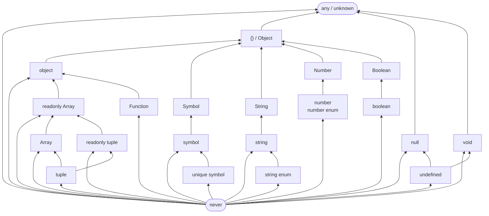

# TypeScript — типизация: краткий гайд

---

## Базовые типы

```ts
let name: string = "Alice";
let age: number = 30;
let active: boolean = true;
let nothing: null = null;
let undef: undefined = undefined;

// any — отключает проверку типов, избегай
let x: any = 42;
x = "oops"; // TS не ругается — плохо

// unknown — безопасная альтернатива any
let val: unknown = getData();
if (typeof val === "string") val.toUpperCase(); // OK — сначала проверяем
```

---

## Массивы и кортежи

```ts
// Массив
const nums: number[] = [1, 2, 3];
const strs: Array<string> = ["a", "b"];

// Кортеж — фиксированная длина и порядок типов
const pair: [string, number] = ["age", 30];
const rgb: [number, number, number] = [255, 128, 0];
```

---

## Объекты — интерфейс и тип

```ts
// Interface — для объектов и классов, расширяемый
interface User {
  id: number;
  name: string;
  email?: string; // необязательное поле
}

// Type — гибче, можно делать union/intersection
type Point = { x: number; y: number };
type ID = string | number; // union type
```

### Когда interface, когда type

| Возможность            | `interface`        | `type`   |
| ---------------------- | ------------------ | -------- |
| Объекты/классы         | ✅ предпочтительно | ✅       |
| Union/Intersection     | ❌                 | ✅       |
| Расширение (`extends`) | ✅ удобнее         | ✅ (`&`) |
| Можно переоткрыть      | ✅                 | ❌       |

---

## Union и Intersection

```ts
// Union — одно ИЗ
type StringOrNumber = string | number;
function format(val: StringOrNumber) { ... }

// Discriminated union — с признаком
type Shape =
  | { kind: "circle"; radius: number }
  | { kind: "rect"; width: number; height: number };

function area(s: Shape): number {
  if (s.kind === "circle") return Math.PI * s.radius ** 2;
  return s.width * s.height;
}

// Intersection — всё СРАЗУ
type Admin = User & { role: string };
```

---

## Функции

```ts
// Типизация параметров и возврата
function add(a: number, b: number): number {
  return a + b;
}
>
// Arrow function
const greet = (name: string): string => `Hello, ${name}`;

// Необязательный и дефолтный параметр
function log(msg: string, prefix?: string): void {
  console.log(prefix ?? "", msg);
}

// Rest параметры
function sum(...nums: number[]): number {
  return nums.reduce((a, b) => a + b, 0);
}
```

---

## Generics — обобщённые типы

Generics — параметры типов, как переменные но для типов.

```ts
// Функция с generics
function identity<T>(val: T): T {
  return val;
}
identity<number>(42); // T = number
identity("hello"); // T = string (TS выводит сам)

// Generic функция — обёртка массива
function first<T>(arr: T[]): T | undefined {
  return arr[0];
}

// Generic интерфейс
interface Box<T> {
  value: T;
  label: string;
}
const box: Box<number> = { value: 42, label: "num" };

// Ограничение через extends
function getLength<T extends { length: number }>(val: T): number {
  return val.length;
}
getLength("hello"); // 5
getLength([1, 2, 3]); // 3
// getLength(42); // ❌ Error — у числа нет length
```

---

## Утилитарные типы

```ts
interface User {
  id: number;
  name: string;
  email: string;
}

// Partial — все поля необязательные
type UserDraft = Partial<User>;
// { id?: number; name?: string; email?: string }

// Required — все поля обязательные
type FullUser = Required<UserDraft>;

// Readonly — запрет изменений
type FrozenUser = Readonly<User>;
const u: FrozenUser = { id: 1, name: "Al", email: "a@b.c" };
// u.id = 2; // ❌ Error

// Pick — выбрать поля
type UserPreview = Pick<User, "id" | "name">;

// Omit — исключить поля
type UserWithoutEmail = Omit<User, "email">;

// Record — объект с фиксированным типом ключей и значений
type Roles = Record<string, "admin" | "user" | "guest">;
const roles: Roles = { alice: "admin", bob: "user" };

// ReturnType — тип возврата функции
function getUser() {
  return { id: 1, name: "Alice" };
}
type UserReturn = ReturnType<typeof getUser>; // { id: number; name: string }
```

---

## Type Guards — сужение типов

```ts
// typeof
function process(val: string | number) {
  if (typeof val === "string") {
    return val.toUpperCase(); // здесь val: string
  }
  return val.toFixed(2); // здесь val: number
}

// instanceof
function handleDate(val: Date | string) {
  if (val instanceof Date) return val.getFullYear();
  return new Date(val).getFullYear();
}

// Custom type guard — функция-предикат
function isString(val: unknown): val is string {
  return typeof val === "string";
}

// Narrowing discriminated union
function area(s: Shape): number {
  switch (s.kind) {
    case "circle":
      return Math.PI * s.radius ** 2;
    case "rect":
      return s.width * s.height;
  }
}
```

---

## as и satisfies

```ts
// as — утверждение типа (используй осторожно!)
const input = document.getElementById("name") as HTMLInputElement;
input.value; // OK — мы сказали TS что это HTMLInputElement

// satisfies — проверяет тип без приведения
const config = {
  host: "localhost",
  port: 3000,
} satisfies Record<string, string | number>;

config.host.toUpperCase(); // OK — TS знает что host это string
```

---

## Readonly и const assertions

```ts
// as const — замораживает значение и тип
const direction = ["up", "down", "left", "right"] as const;
type Direction = (typeof direction)[number]; // "up" | "down" | "left" | "right"

const config = { env: "prod", port: 3000 } as const;
// config.env: "prod"  (не string — литеральный тип)
```

---

## Иерархия типов — кто кому assignable

Стрелка = "является подтипом" / "assignable to" (снизу вверх).



### Ключевые правила

| Тип                               | Assignable to                                            |
| --------------------------------- | -------------------------------------------------------- |
| `never`                           | всё (bottom type)                                        |
| `any`                             | всё и из всего (обходит проверки)                        |
| `unknown`                         | только `unknown` и `any` без сужения                     |
| `undefined`                       | `void`, `null` (и любой `T \| undefined`)                |
| `null`                            | `unknown`, `any` (в strict режиме — только они)          |
| `string enum`                     | `string`                                                 |
| `number enum`                     | `number`                                                 |
| `unique symbol`                   | `symbol`                                                 |
| `tuple`                           | `Array`, `readonly Array`, `readonly tuple`              |
| примитивы (`string`, `number`...) | wrapper-классы (`String`, `Number`...) → `{}` → `object` |

> **`{}`** принимает всё кроме `null` и `undefined` (в `strictNullChecks`).

---

## Реализация утилитарных типов вручную

Понять как устроены встроенные утилиты — лучший способ освоить mapped types и conditional types.

### Mapped Types (перебор ключей объекта)

```ts
// Record<T, K> — объект, где ключи из T, значения типа K
// T ограничен — ключом может быть только string | number | symbol
type MyRecord<T extends string | number | symbol, K> = {
  [P in T]: K;
};
// пример: MyRecord<'a' | 'b', number> → { a: number; b: number }

// Readonly<T> — все поля только для чтения
type MyReadonly<T> = {
  readonly [P in keyof T]: T[P];
//        ↑ модификатор    ↑ сохраняем тип каждого поля
};

// Partial<T> — все поля необязательные
type MyPartial<T> = {
  [P in keyof T]?: T[P];
  //            ↑ добавляем ?
};

// Required<T> — убираем необязательность (модификатор -?)
type MyRequired<T> = {
  [P in keyof T]-?: T[P];
  //            ↑ минус удаляет модификатор ?
};
```

> **Модификаторы в mapped types:**
>
> - `+readonly` / `readonly` — добавить readonly
> - `-readonly` — убрать readonly
> - `+?` / `?` — сделать необязательным
> - `-?` — сделать обязательным

---

### Conditional Types (условные типы)

```ts
// Exclude<T, U> — убрать из T всё что входит в U
type MyExclude<T, U> = T extends U ? never : T;
// пример: MyExclude<'a' | 'b' | 'c', 'a'> → 'b' | 'c'
// работает через дистрибутивность: каждый член union проверяется отдельно

// Extract<T, U> — оставить в T только то что входит в U
type MyExtract<T, U> = T extends U ? T : never;
// пример: MyExtract<'a' | 'b' | 'c', 'a' | 'b'> → 'a' | 'b'

// NonNullable<T> — убрать null и undefined
type MyNonNullable<T> = T extends null | undefined ? never : T;
// пример: MyNonNullable<string | null | undefined> → string
```

---

### infer — вывод типа внутри conditional type

`infer P` говорит TS: «выведи этот тип и дай мне его под именем P».

```ts
// Parameters<T> — кортеж параметров функции
type MyParameters<T extends (...args: any) => any> = T extends (
  ...args: infer P
) => any
  ? P
  : never;
//                         ↑ вывести тип аргументов в P
// пример: MyParameters<(a: string, b: number) => void> → [string, number]

// ConstructorParameters<T> — параметры конструктора
type MyConstructorParameters<T extends new (...args: any) => any> =
  T extends new (...args: infer P) => any ? P : never;
//           ↑ new — значит это конструктор

// ReturnType<T> — тип возвращаемого значения
type MyReturnType<T extends (...args: any) => any> = T extends (
  ...args: any
) => infer R
  ? R
  : never;
//                                    ↑ вывести тип возврата в R
// пример: MyReturnType<() => string> → string

// InstanceType<T> — тип экземпляра класса
type MyInstanceType<T extends new (...args: any) => any> = T extends new (
  ...args: any
) => infer R
  ? R
  : never;
// пример: MyInstanceType<typeof Date> → Date
```

---

### Key Remapping — переименование ключей через as

```ts
// Omit<T, K> — исключить ключи K из объекта T
type MyOmit<T, K extends keyof T> = {
  [P in keyof T as P extends K ? never : P]: T[P];
  //             ↑ as — ремаппинг: если ключ входит в K → убираем (never)
};
// пример: MyOmit<{a:1, b:2, c:3}, 'a' | 'b'> → { c: 3 }
```

---

### Шпаргалка: что за чем стоит

| Утилита        | Механизм                      | Ключевая идея             |
| -------------- | ----------------------------- | ------------------------- |
| `Readonly`     | mapped type + `readonly`      | модификатор поля          |
| `Partial`      | mapped type + `?`             | модификатор поля          |
| `Required`     | mapped type + `-?`            | снятие модификатора       |
| `Record`       | mapped type                   | перебор union как ключей  |
| `Exclude`      | conditional + `never`         | дистрибутивность union    |
| `Extract`      | conditional                   | противоположность Exclude |
| `NonNullable`  | conditional + `never`         | частный случай Exclude    |
| `Parameters`   | conditional + `infer`         | вывод типа аргументов     |
| `ReturnType`   | conditional + `infer`         | вывод типа возврата       |
| `InstanceType` | conditional + `infer` + `new` | вывод типа экземпляра     |
| `Omit`         | mapped type + `as` + `never`  | key remapping             |

---

## Быстрая шпаргалка

| Конструкция       | Пример                       |
| ----------------- | ---------------------------- |
| Базовый тип       | `let x: number`              |
| Опциональное поле | `name?: string`              |
| Union             | `string \| number`           |
| Intersection      | `A & B`                      |
| Generic           | `function f<T>(x: T): T`     |
| Сужение           | `if (typeof x === "string")` |
| Partial           | `Partial<User>`              |
| Pick              | `Pick<User, "id" \| "name">` |
| Omit              | `Omit<User, "email">`        |
| Record            | `Record<string, number>`     |
| as const          | `["a", "b"] as const`        |
